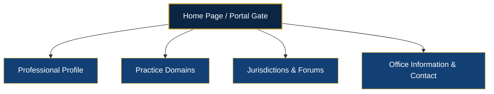

# ADV. TANWAR SINGH — WEBSITE BLUEPRINT & COPYWRITING SYSTEM
**Jurisdiction:** Principal Seat of the High Court of Judicature for Rajasthan at Jodhpur & Central Administrative Tribunal (CAT)
**Core Specialization:** Service Matter Law & Administrative Disputes

---

## 1. Regulatory Compliance Framework (Bar Council of India)
Under **Rule 36 of the Bar Council of India Rules**, advocates are prohibited from advertising or soliciting work, either directly or indirectly. The design and copy of this website adhere strictly to this rule by:
*   **Informational Dissemination Only:** Focusing strictly on credentials, academic background, contact details, and areas of practice.
*   **No Boastful Language:** Avoiding comparative adjectives (e.g., "best," "top," "leading," "aggressive") or claims of success rates.
*   **Mandatory BCI Disclaimer:** Requiring a user-initiated confirmation gate (or prominent overlay disclaimer) stating that the visitor is seeking information voluntarily.

---

## 2. Site Architecture (5-Page Menu Structure)

An institutional, secure, and user-friendly site architecture designed to establish immediate credibility.



### Page 1: Home (The Informational Anchor)
*   **Purpose:** Establishes the advocate's presence, location (Jodhpur), practice focus (Service Matters), and provides direct navigation to key administrative information.
*   **Core UI Elements:** Hero display, jurisdiction trust anchors, practice area summaries, office location map, and the mandatory BCI disclaimer.

### Page 2: Professional Profile & Credentials (The Trust Pillar)
*   **Purpose:** Details the advocate's legal credentials, professional journey, Bar Council enrollment, and academic profile.
*   **Core Content:** Bar Council of Rajasthan Enrollment Number, Academic background (LL.B./LL.M.), professional memberships (Rajasthan High Court Advocates' Association, Jodhpur), and focus on administrative law.

### Page 3: Practice Domains (Service Matter Law Spec)
*   **Purpose:** Deep dive into specific service-related legal issues to assist government and PSU employees in identifying their relevant administrative issues.
*   **Core Content Subsections:**
    1.  Suspensions & Departmental Inquiries
    2.  Promotion Disputes & Seniority List Contests
    3.  Wrongful Termination & Compulsory Retirement
    4.  Pension, Gratuity & Retiral Benefits
    5.  Central Administrative Tribunal (CAT) Origination Applications

### Page 4: Jurisdictions & Forums (Rajasthan Jurisdiction Map)
*   **Purpose:** Clarifies where the advocate represents clients, emphasizing the geographical reach and judicial bodies.
*   **Core Content:** Jodhpur High Court (Principal Seat), Jaipur Bench (High Court), Central Administrative Tribunal (CAT) Jodhpur Bench, and Rajasthan Civil Services Appellate Tribunal.

### Page 5: Office Information & Contact (Intake & Compliance)
*   **Purpose:** Provides structural details on how to schedule an appointment or reach the chamber, accompanied by a clean contact intake form.
*   **Core Content:** Physical office address in Jodhpur, map integration, phone and secure email coordinates, and a clear guide on the document set required for consultations.

---

## 3. High-Impact Copywriting (Hero Section)

To balance BCI compliance with high authority, the copy uses **objective, institutional, and reassuring terms** that signal deep domain knowledge to government employees facing career crises.

### **Headline**
> **SERVICE MATTERS & ADMINISTRATIVE LAW ADVOCACY**

### **Sub-Headline**
> **Legal representation for Central Government, State Government, Defense, and PSU employees before the High Court of Judicature for Rajasthan at Jodhpur and the Central Administrative Tribunal (CAT).**

### **Primary CTA Button**
> **Request Case Consultation**

### **Secondary CTA Button**
> **View Practice Areas**

### **UX Writing Note (Security/Assurance Micro-copy placed below CTAs):**
> *“Consultations are strictly confidential and scheduled in accordance with Bar Council of India guidelines.”*

---

## 4. Landing Page Wireframe Blueprint (Section-by-Section)

Designed with a premium **Royal Navy (#0B2545)**, **Antique Gold (#D4AF37)**, and **Crisp Off-White (#F4F5F7)** palette.

```
+------------------------------------------------------------------------------------+
|                                    NAVIGATION BAR                                  |
| [Adv. Tanwar Singh] (Logo)               Profile | Practice | Forums | Contact | [CTA] |
+------------------------------------------------------------------------------------+
|                                                                                    |
|                                    1. HERO SECTION                                 |
|                                                                                    |
|       SERVICE MATTERS & ADMINISTRATIVE LAW ADVOCACY                               |
|       Legal representation for Central Government, State Government,               |
|       Defense, and PSU employees before the High Court of Judicature               |
|       for Rajasthan at Jodhpur and the Central Administrative Tribunal (CAT).      |
|                                                                                    |
|       [Request Consultation] (Gold)      [View Practice Areas] (Bordered)          |
|                                                                                    |
|       *Confidential consultations under BCI guidelines.                            |
|                                                                                    |
+------------------------------------------------------------------------------------+
|                                 2. LOCAL TRUST ANCHORS                             |
|                                                                                    |
|       [Jodhpur High Court]         [CAT Jodhpur Bench]        [Rajasthan Bench]    |
|         (Principal Seat)           (Central Adm. Tribunal)      (Appellate Tribunal) |
|                                                                                    |
+------------------------------------------------------------------------------------+
|                               3. PRACTICE DOMAIN PILLARS                           |
|                                                                                    |
|     +--------------------+   +--------------------+   +--------------------+       |
|     |  Suspensions &     |   | Promotion &        |   | Retiral &          |       |
|     |  Inquiries         |   | Seniority Disputes |   | Pension Claims     |       |
|     |  Detailed law...   |   | Detailed law...    |   | Detailed law...    |       |
|     +--------------------+   +--------------------+   +--------------------+       |
|                                                                                    |
+------------------------------------------------------------------------------------+
|                            4. CHAMBERS & PROFESSIONAL CREDENTIALS                  |
|                                                                                    |
|     [Advocate Portrait / Chamber Image]                                            |
|     - Enrolled with Bar Council of Rajasthan                                       |
|     - Dedicated representation in Service Jurisprudence                            |
|     - Academic credentials from leading legal institutions                         |
|                                                                                    |
+------------------------------------------------------------------------------------+
|                             5. CLIENT INTAKE & SCHEDULING                          |
|                                                                                    |
|     Name: [__________]  Service Sector: (Central / State / PSU / Defense)          |
|     Forum: (High Court / CAT / State Tribunal)  Brief Case Category: [___________] |
|                                                                                    |
|     [Submit Consultation Inquiry]                                                  |
|                                                                                    |
+------------------------------------------------------------------------------------+
|                                     6. FOOTER & BCI                                |
|                                                                                    |
|     Legal Disclaimer | Privacy Policy | Site Map | Office Address (Jodhpur, RJ)    |
+------------------------------------------------------------------------------------+
```

### Visual Specifications for Figma/Web Developer:
*   **Typography:** Playfair Display (Headings - Serif, represents institutional heritage) paired with Inter or Roboto (Body Text - Sans-Serif, represents modern legibility).
*   **Visual Elements:** Use custom brass-colored line dividers, high-quality architectural illustrations of the Jodhpur High Court dome, and institutional icons. Avoid stock images of gavels or scales of justice, which feel generic and non-premium.

---

## 5. Local Trust Anchors & Visual Integration

To signal strong regional expertise, specific local identifiers are woven into the design:

1.  **High Court Principal Seat Reference:** Clearly label the practice location as the *Principal Seat of the High Court of Judicature for Rajasthan at Jodhpur* to distinguish it from the Jaipur Bench, indicating close physical proximity to the main registry.
2.  **CAT Jodhpur Bench Integration:** Display a dedicated section detailing representation before the *Central Administrative Tribunal (CAT) Jodhpur Bench*, which is critical for Central Government and Defense/Civilian employees.
3.  **Rajasthan Civil Services Appellate Tribunal:** Highlight representation before state-specific tribunals located in Rajasthan, showing a comprehensive grasp of both Central and State service rules.
4.  **Local Office Anchor:** Include a map pointing to the physical chambers in Jodhpur, showcasing readiness to handle filing procedures, writ petition listings, and urgent stay application hearings directly at the Principal Seat.
